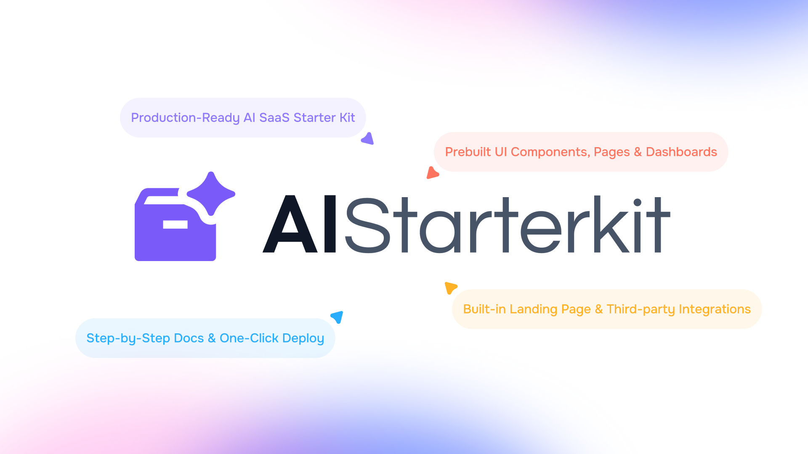

# ATLAS AI Employee

ATLAS AI Employee is a no-code AI platform that enables businesses to create intelligent AI employees for customer support, lead capture, and business growth.



This repo contains the MVP implementation of ATLAS AI Employee, built with **Next.js**, **TypeScript**, and **Tailwind CSS**. It includes the core workflow for onboarding a business, training an AI on business data, opening a chat assistant, and capturing leads from unknown customer questions.


### Quick Links

- [✨ Product Homepage](#)
- [🚀 Getting Started](#getting-started)

ATLAS AI Employee helps businesses launch a working AI assistant in minutes, without code.
## Key Features

- **Next.js & Tailwind CSS:** Modern tech stack for fast, responsive, and scalable development with clean UI powered by Tailwind v4 and Next.js performance.
- **AI Integration:** Plug-and-play access to GPT, Midjourney, and other APIs to build AI features like text, code, and image generation instantly.
- **All Essential Integrations:** Come with all essential integrations like Stripe, NextAuth, and Drizzle ORM —skip setup and start shipping core AI SaaS features.
- **Pre-built SaaS Pages:** Includes dashboard, auth, pricing, error, and blog pages—launch-ready and designed to save weeks of development time.
- **Highly Customizable:** Modular code structure makes it easy to tweak layouts, replace logic, or add new features based on your product needs.
- **One-click Deployment on Vercel and Others:** Deploy on Vercel, netlify and other PaaS with one-click. Simply add environment variables and hit deploy button.
- **Lifetime Free Updates:** One-time purchase gives you ongoing updates—new features, improvements, and fixes without extra fees or monthly costs.

| ✨ Features                         | 🎁 AIStarterKit Free                 | 🔥 AIStarterKit Pro                        |
|----------------------------------|--------------------------------|--------------------------------------|
| Next.js Pages                    | Static                         | Dynamic Boilerplate Template         |
| Components                       | Limited                        | All According to Demo                |
| AI Functionality                 | Demo Only                      | Included                             |
| AI App Examples                  | 1 Example                      | All Examples (Same as Demo)          |
| Integrations (DB, Auth, etc.)    | Not Included                   | Included                             |
| Community Support                | Included                       | Included                             |
| Premium Email Support            | Not Included                   | Included                             |
| Lifetime Free Updates            | Included                       | Included
  
## Getting Started

We are using npm as our package manager.

> To use Yarn or any other package manager, delete the `package-lock.json` file and run the below commands using the package manager of your choice.

1. Install dependencies

   ```bash
   npm install
   ```

2. Rename `.env.example` to `.env` and set the environment variables

3. Development server

   ```bash
   npm run dev
   ```

   Your app template should now be running on [http://localhost:3000](http://localhost:3000).

   Additional commands:

   ```bash
   npm run build # Build the project
   npm run start # Start the production server
   ```

## Features

- [Next.js](https://nextjs.org) App Router
  - Advanced routing, SEO, and performance
  - React Server Components (RSCs) and Server Actions for server-side rendering
- [AI SDK](https://sdk.vercel.ai/docs)
  - Unified API for generating text and tool calls with LLMs
  - Supports OpenAI (default) and other model providers.
